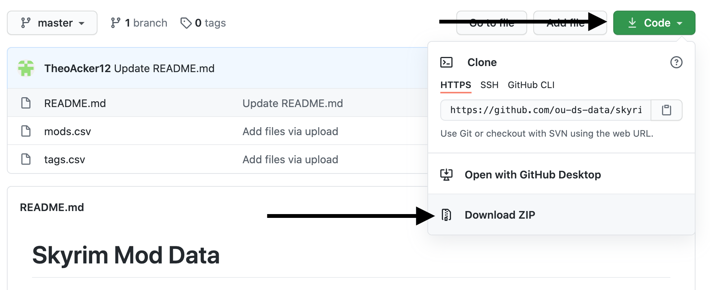

!!! This is the latest version of this tutorial. If there are any problems with it, you can access the [previous Tableau tutorial](https://www.ds-tutorials.oucreate.com/tableau-skyrim-v1) instead.

## What is Tableau?

Tableau is a powerful and popular drag-and-drop data visualization tool that allows users to create interactive visualizations without any programming. It has a free version called Tableau Public that anyone can download and use. The only caveat is that you have to save your visualization online. There are ways to hide your creations so that they are not searchable and are not visible on your profile, but this would not be good enough if you have truly sensitive data.

## Objectives

The purpose of this tutorial is to give you a working knowledge of Tableau so that you feel comfortable working and experimenting with it using your own data. We will cover how to make a map, a bar chart, and a scatterplot, how to add filters and formatting, and how to combine multiple charts together into one visualization.

If you follow along with the material in this tutorial, by the end you will have a visualization that looks similar to the one below:

<iframe width="100%" height="750px" src="https://public.tableau.com/views/SkyrimMods/ModsDashboard?:embed=y&:display_count=yes&:showVizHome=no" title="Sample Tableau Visualization" frameborder="0" marginheight="-50"></iframe>

## Setup

There are several required resources to complete the tutorial. These are:

- The dataset
- A Tableau Public account
- The Tableau Public software

### Data

We will be using a [Skyrim mods dataset](https://github.com/ou-ds-data/skyrim-mods) for this tutorial. More information about the dataset (and what Skyrim mod data means) will be provided in the next section. If you are unfamiliar with GitHub, instructions for downloading are below.

1. Access the data on GitHub using the link above.
2. Download the data by expanding the green **Code** button and then choosing **Download ZIP**.

3. Unzip the data. On a Mac you can do this by double clicking the downloaded zip file. On Windows you can right click and choose _Extract All_.
4. Move the folder to your Desktop or somewhere else you can easily locate it.

### Tableau Public

You can create a Tableau Public account by clicking the **Sign Up** button at the top of the top of the [Tableau Public website](https://public.tableau.com/en-us/s/).

The Tableau Public website is also where you can download the application. The button should be in the center of the screen. Tableau Public is available for both Windows and Mac (Linux users will need a VM), and the application will take approximately 1.5GB of disk space. If you are having difficulties or are concerned that your computer may not meet the system requirements, Tableau has a list of [technical specifications](https://public.tableau.com/en-us/s/techspecs).

## Tableau Public vs. Tableau Desktop

!!! This section is optional. Tableau Public is what I used throughout the tutorial and should be sufficient for many, if not most, use cases.

Tableau Public is available for free. While there are a few differences between it and Tableau Desktop, which requires a license, both have the same basic functions available. Students and instructors/researchers are eligible for [free, renewable, one-year licenses](https://www.tableau.com/academic). However, I would not necessarily recommend applying for a license just because you can. Consider the pros and cons of getting a Tableau Desktop license before you decide.

### Tableau Desktop: Pros

- You can keep sensitive data private (by saving to your computer rather than Tableau Public). This will not be an issue in many cases, since if you have sensitive data you will probably work with it and anonymize it before creating a visualization, but if it is an issue it will be a very important one!
- It is easy to save your work as you go. Tableau Desktop allows you to save to your computer, which is a much faster process than saving to the Tableau Public servers.
- You can establish live connections to data sources. This means you can connect to online sources and/or sources that update regularly. This is less of an issue if you use Google Sheets. While Tableau Desktop will almost certainly provide faster updates when you make changes, Tableau Public is able to connect to Google Sheets.
- Some people reply to Tableau questions on the forums by posting a sample workbook. Oftentimes, these workbooks are not saved to Tableau Public, meaning you will only be able to open them if you have Tableau Desktop.

### Tableau Desktop: Cons

- You can only renew your license as long as you remain a student or instructor.
- If you save a workbook and then your license expires, you will only be able to open that workbook with Tableau Public if you saved it to the Tableau Public servers. In a pinch you could sign up for a free trial and use that handful of days to open all of your Tableau Desktop workbooks and save them appropriately, but this is certainly not ideal.
- You have to renew your license every year. If you forget, you may be without Tableau Desktop for a little while.

### Final Thoughts

There should currently be no difference in actual functionality between Tableau Desktop and Tableau Public. So even if you do not have a license or you have a license but it expires, you will still be able to do all the same things as far as creating worksheets, dashboards, and stories. As a caveat, just because that is the case now does not mean it always will be. Keep in mind that Tableau is proprietary software, so the company could limit functionality at any time they like. Hopefully this will not happen, but it is always good to be aware of the possibility.