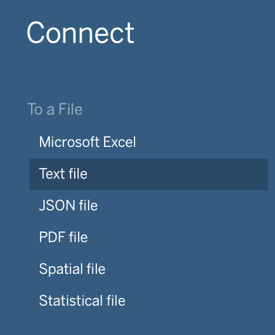
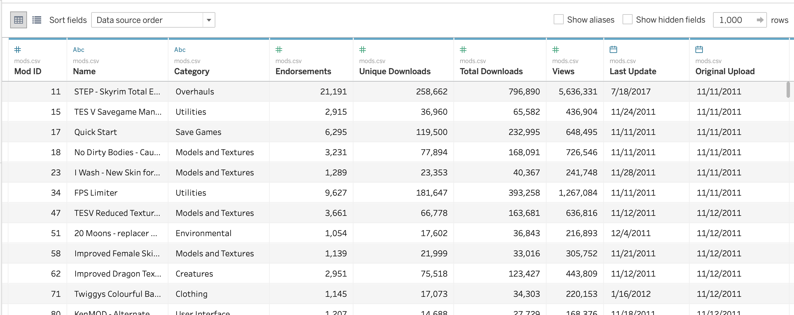
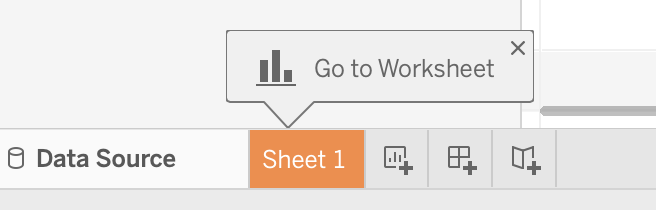
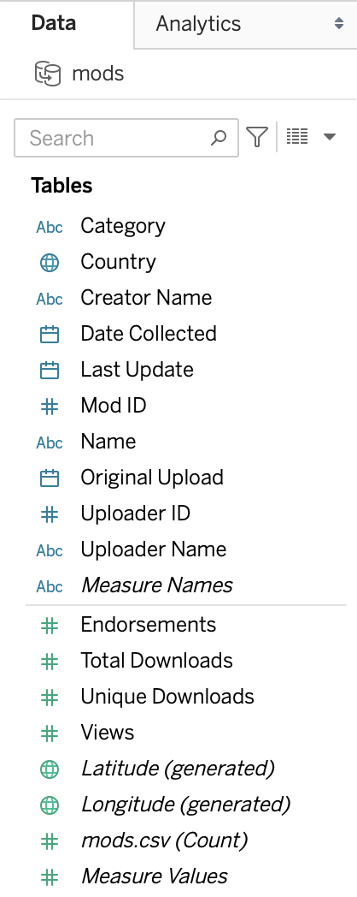
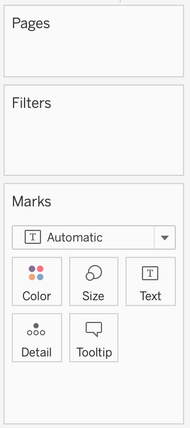
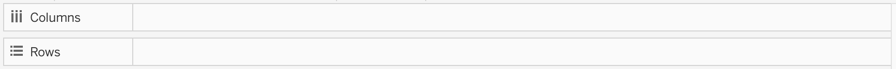

!!!! ## Learning Objectives
!!!!
!!!! - Describe the dataset we are working with.
!!!! - Identify and define the different parts of a Tableau worksheet.

## The Dataset

In this tutorial we will be visualizing Skyrim mod data. For reference, Skyrim is a roleplaying video game set in a vast fantasy world and often heavily modded. Mods are special modifications that can be added to a game. They can do anything from totally overhauling the alchemy system ([Complete Alchemy and Cooking Overhaul](https://www.nexusmods.com/skyrim/mods/69306)), redoing the user interface ([SkyUI](https://www.nexusmods.com/skyrim/mods/3863)), replacing all dragons with Thomas the Tank Engine characters ([Really Useful Dragons](https://www.nexusmods.com/skyrim/mods/48593)), or simply adding a single weapon ([Longclaw](https://www.nexusmods.com/skyrim/mods/36127)) to the game. (If you only follow one of those links, I recommend [Really Useful Dragons](https://www.nexusmods.com/skyrim/mods/48593).)

This data has been scraped from Nexus Mods, the primary site for hosting and downloading Skyrim mods. The data has been cleaned/modified slightly to make it easier to user. For more information on how the data was collected, potential issues, and what cleanup was performed, view the [dataset notes](https://github.com/ou-ds-data/skyrim-mods/blob/master/README.md).

### Exploring the Data

Before we start working with the data, it is important to look over it so we know what we are working with. In the folder you downloaded there should be three files: README.md, mods.csv, and tags.csv. Find and open mods.csv. CSV stands for _comma-separated values_, a common format for storing large quantities of data. Each new line in the file marks a new record, and each comma represents a new piece of data about that record. Most computers can recognize a CSV and will open it using spreadsheet software like Microsoft Excel or LibreOffice Calc. Note that in mods.csv, each record/row is a mod. The file contains the 5,000 highest endorsed mods at the time of collection.

Some columns of interest:

1. **Mod ID** - This is a unique identifier for each mod. Although this is not something we would want to visualize, its uniqueness provides a different kind of value that we will make use of in this tutorial.
2. **Name** - This is the name of the mod. As such, it provides some insight into what the mod is about and could provide interesting context to some visualizations.
3. **Category** - There are 58 different categories in this dataset. We can use these to group and visualize the data.
4. **Endorsements** - Every Nexus user who downloads a mod has the option to endorse that mod, the equivalent of giving it a _like_ or _thumbs up_.
5. **Unique Downloads** - This provides a count of how many different Nexus users have downloaded the mod from the site.
6. **Total Downloads** - This provides a count of the number of times the mod has been downloaded from the site. Many users will download a given mod more than once for a variety of reasons, like the mod being updated.
7. **Country** - This is the country listed in the user profile of the user who uploaded the mod. While many of them are _Not Specified_, there are enough that are specified for us to use this geographical data to create a map.

Once you are satisfied looking over mods.csv you can close it. There is no need to open up tags.csv unless you really want to. It has some of the same data, but each mod has a record in tags.csv for each tag it has been given. For the 5,000 mods, we have 24,364 records of tags.

As we go through this tutorial you can imagine that you work for a news/entertainment website. You have been given this data and instructed to create a visualization that will allow users to explore the dataset as part of an entertainment article about video games and/or mods.

## Loading Data into Tableau

1. Open your Tableau application
2. Under **Connect**, select _Text file_. Note that although your computer will open a CSV as a spreadsheet, the CSV is still, ultimately, a text file.

3. Navigate to and open your mods.csv in the explorer or finder window that appears.
4. You should now see your data displayed in Tableau.

## Worksheet Overview

Tableau has already created a blank worksheet for us. Click the Orange Sheet 1 tab at the bottom left of the screen to view it. Note the three buttons next to it for new worksheets, new dashboards, and new stories.

We will now look over some of the basic parts of the worksheet.

### Data - Tables

The **Data** tab on the left side of the screen provides a list labeled **Tables**. This is a list of columns from mods.csv. Note familiar names from the dataset, like _Country_ or _Endorsements_.

There are actually two lists here, separated by a faint line. The top list shows columns Tableau recognizes as **Dimensions**. These generally contain more categorical or non-numerical types of data. The second list shows **Measures**, which are columns with numerical, continuous data - anything you could take a sum or an average of and have it mean something. Tableau uses the terms Dimension and Measure elsewhere, so it is useful to know what it is referring to.

Next to each column name, there is an icon indicating the data type. The globe icon indicates that it is geographic data, the # indicates that it is numeric data, _Abc_ indicates that it is textual data, and the calendar icon indicates that it is a date.

!!! Tableau uses color to help differentiate between Dimensions and Measures. Dimensions are associated with blue, and Measures with green. You can see this at work in the colors of the symbols.

A few of the names here are in italics. These are not columns from the dataset, but are automatically generated by Tableau.

### Pages, Filters, and Marks

These three sections, found in a column to the right of the **Data** tab, are typically either called shelves or cards.

We will not be working with the **Pages** shelf in this tutorial, but it is useful to make note of. You can place a dimension (or measure) here to create a new "page" for each category in that dimension. Users can then cycle through these pages. An example would be showing change over time and having users cycle through years.

We will work with the **Filters** shelf and the **Marks** shelf, so for now make a note of their existence.

### Rows and Columns

These are found at the top of the worksheet and will help define how our data is displayed. Fortunately, we will usually be able to let Tableau handle the specifics.

### The Worksheet

Also called the canvas, this is where our data will be displayed. Since we currently have not told Tableau to display anything, the canvas should contain the text _Drop field here_.

### Show Me

This button at the top right can be toggled on and off to show a list of the various types of charts we can use and allow us to switch between them. It will highlight various options as they come available. It also shows what dimensions/measures are required to be able to use a given type of chart.

## Renaming the Worksheet

Sheet 1 is not a very informative name. This will become more of an issue as we add sheets - it is difficult to remember what Sheet 1 is as opposed to Sheet 2 or Sheet 3. Therefore, we should go ahead and rename our first worksheet.

Find the _Sheet 1_ tab at the bottom of the application window and right click on it. Then, type in whatever name you like. For this example we will use _Map_. Press **Enter** to save the new name.

!!! It is useful to know that Tableau does support the use of _Undo_ and _Redo_. There are arrows at the very top left that you can use, or you can use the keyboard shortcuts. Undo is &#8984; + Z (Mac) or ctrl + Z (Windows). Redo is &#8984; + Y (Mac) or ctrl + Y (Windows).