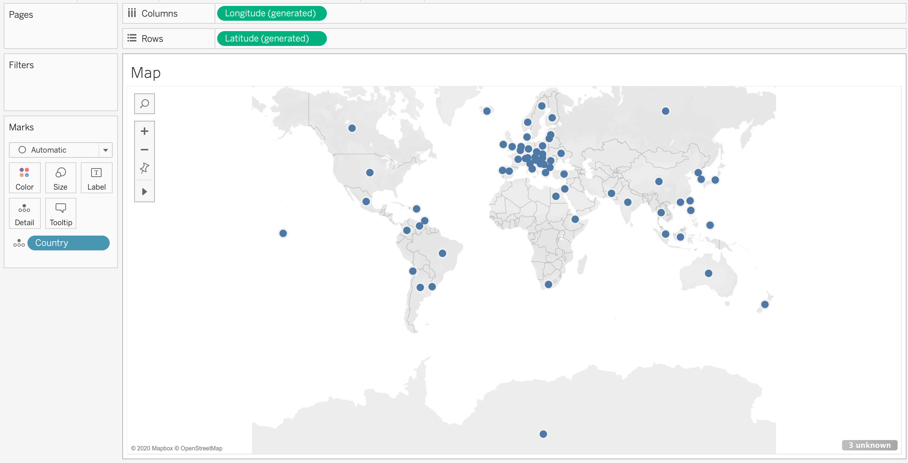
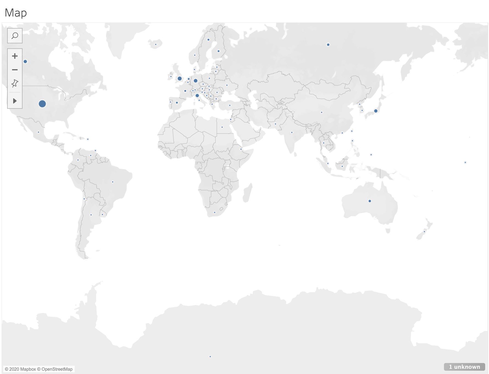
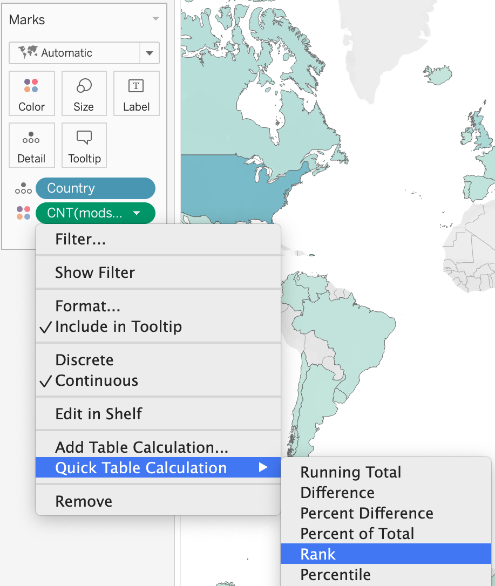
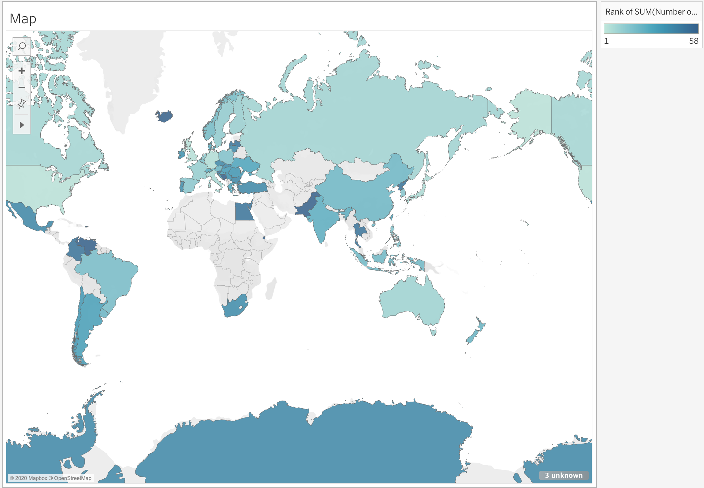

!!!! Learning Objectives
!!!!
!!!! - Create a map using geographic data.
!!!! - Use **Show Me** to change the currently selected type of chart.
!!!! - Use quick calculations on measures.

Our goal is to create a map to see what countries mods are coming from and in what quantities. Hopefully this will provide a more global perspective to Skyrim modding.

Maps are used in many different types of visualizations. Two examples you are likely quite familiar with are weather maps and political maps. Where else have you seen maps used for data visualization? What worked well and what did not? When it comes to designing your own map, drawing from experience is the most important thing you can do.

Tableau recognizes a variety of types of geographic data, from special spatial datasets to lists of coordinates. In our case, we have a list of text data with the column header _Country_. This is all Tableau needs to be able to visualize the data appropriately.

## Add Data

The first step in creating a map is to add our data to the worksheet.

1. Locate _Country_ from the **Data** sidebar. Note that Tableau recognizes _Country_ as geographic data, even though it is simply a column with country names.
2. Drag _Country_ onto the worksheet. This may take a moment to process as Tableau builds the initial map. Tableau will plot each data point on top of the default base map showing the countries.

! At the bottom of the screen you may notice that there are 3 unknown values. We will investigate this further (and deal with the values) in the next page.
3. While we can now see which countries have produced mods, we still want to know how many mods each country has produced. To do this we will need to add the desired measure to our worksheet. Locate _mods.csv (Count)_ from the **Data** sidebar. If you have an earlier version of Tableau.
! Note that _mods.csv (Count)_ is in italics, indicating that it is not information stored in one of the columns of our dataset. Instead, this is automatically generated by Tableau counting the number of records (rows) in the dataset holding each category value of the chosen dimension (in this case _Country_). Because each record in mods.csv is a mod, _mods.csv (Count)_ is the same thing as number of mods, which is exactly what we want to see.
4. Drag _mods.csv (Count)_ onto the map. The country dots should change in size depending on the value.

## Change Map Type

It is very strange to me to see points (or dots) representing countries on the map. Points make perfect sense for cities, but countries are typically represented with their respective shapes, the way the base map is displaying them. To switch from circles to country shapes, click on the **Show Me** tab at the top right. Note that we are currently using the recommended chart _symbol maps_. Click on _maps_ to the right, instead.

The map should now look like this:

Because the United States has produced so many mods, it is hard to see or differentiate between many of the other country colors. If instead of the sum total number of mods we rank that sum and display each country's rank, the color shades should be much more spread out.

1. Find _CNT(mods.csv)_, formerly _SUM(Number of Records)_, on the **Marks** shelf. (It should be right below _Country_.)
2. Right click on it or hover over it and click the arrow that appears on the right.
3. Choose: Quick Table Calculation -> Rank.

The resulting map should look something like the one shown below. It is now much easier to differentiate between countries. Note that the color shades have reversed as well, with the top rank becoming the lightest.

