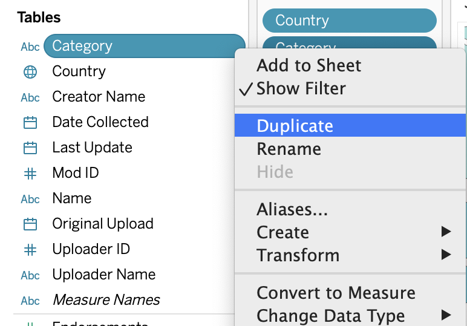

We can deal with data issues and make our visualization more interactive by adding filters. In this section we will deal with the message at the bottom of our map that says _3 unknown_. We will also add an interactive _Category_ filter.

!!!! ## Learning Objectives
!!!! 
!!!! - Exclude data using filters.
!!!! - Create interactive filters for users.

## What is a Filter?

At its most basic level, a filter allows us to specify what values to include or exclude in our visualization. This is how we can deal with many data issues, like null (non-existent) values. It is also possible to add an interactive filter. This kind of filter (generally) does not add or remove anything from the visualization to start with, but viewers of the finished project can use the filter to specify or exclude values temporarily. 

For example: We could add a filter to include only the United States in our visualization, meaning only mods created in the US would be shown. Alternatively, we could add a generic country filter. A user could then choose the United States to only see mods created in the US, but they could also choose any other country and would be able to go back to viewing all of the countries at any time.

## Dealing with _3 unknown_

Since the moment we added _Country_ to the worksheet, this "3 unknown" message at the bottom of the map has been bothering me.

1. Click on the message. A dialog box will pop up with three options: Edit Locations..., Filter data, and Show data at default position.
2. Choose Edit Locations.... Even if we do not edit anything, this option allows us to see what values are causing an issue.

3. There are two columns here, with the data we are most interested in the top rows. The first three values in the _Your Data_ column (England, Not specified, and Wales) are listed as _Unrecognized_ in the _Matching Location_ column. Tableau only recognizes the United Kingdom, so we will need to tell it to map England and Wales as part of the UK. If we click on the box saying _Unrecognized_ and start typing _United Kingdom_, a drop down will pop up with various options, including the one we want. Select this for both England and Wales.

4. Click OK.
! Note that we did not actually change the data - the Country fields for these records will still state _England_ or _Wales_, but now Tableau will know how to map these values. This would not be a solution for cleaning messy data. A good option is [OpenRefine](https://openrefine.org/), a free, open-source tool that makes it easy to investigate and clean data. OU Digital Scholarship maintains an [OpenRefine tutorial](https://ds-tutorials.github.io/openrefine-tutorial/) if you are interested.

### Removing _Not Specified_ Country Values

There is not a good value to map our unspecified countries. We do want to remove them, however, because they are being counted as a country in their own right. This can interfere with our visualization. The easiest way to see this is to hover over the United States and see that it is ranked #2 for number of mods although it should be ranked #1. This filter is to solve a data issue, so it will not need to be interactive.

1. Locate _Country_ from the **Data** sidebar.
2. Drag it onto the **Filters** shelf. Pay special attention to the small orange triangle that appears on the edge of the box. This, in addition to the orange outline, indicates that _Country_ will be added.

! Note: An alternative to this would be to find _Country_ on the **Marks** shelf, right click, and choose _Filter..._
3. The popup that appears will default to the _General_ tab with _Select from list_ chosen. In the list, select only the value for _Not specified_. If necessary, click the _None_ button first to deselect all values.
4. Then click the checkbox for _Exclude_. The Summary Selection should read: _Excluded 1 of 69 values_.

5. Click OK.
! Note: An alternative would be to select every value except for _Not Specified_ and to leave _Exclude_ unchecked. Both options would have the same result.

## Adding a Category Filter

Now we can add an interactive filter that will allow users to view the distribution of mods for the various mod categories. This kind of filter will not make any changes to our data. Instead, users will be able to manipulate the finished visualization themselves.

1. Locate _Category_ from the **Data** sidebar.
2. Drag _Category_ to the **Filters** shelf.
! Make sure you can see the orange triangle we noticed earlier when adding _Country_. If you do not, that may be because Tableau thinks you want to replace the _Country_ filter with _Category_. The solution is to make sure not to drag _Category_ on top of _Country_.
3. In the popup, choose _Use all_ instead of the default _Select from list_.

4. Click OK. This will not change anything on our map.
5. Right click on _Category_ from **Filters** and choose _Show Filter_. This will display an interactive filter on the worksheet.

By default, this filter will be a long list of checkboxes. Note that the first option is _(All)_ and that the second is _Null_.

## Removing _Null_ from the Category Filter

The second option on our new filter is _Null_, which is a placeholder for a non-existent value. As a category, null is meaningless, so it would be best to filter it out. More than that, we do not want to include this as an option in the interactive filter provided to users. This is a data issue that should be taken care of behind the scenes. Unfortunately, since we already have a category filter, removing null values (without changing that filter) is a little bit complicated. Simply unchecking the box on the filter would still leave it visible to end users, so we have to add a second category filter. Dragging _Category_ to **Filters** will not accomplish this: We will be able to edit our current filter, but we will not be able to add a second filter for the given dimension. Instead, we will have to use a workaround.

! If you are curious, there are two mods with no value for category. This was not an error in data collection: I looked up the mod pages for those two mods, and somehow they do not have categories.

1. Right click on _Category_ under **Dimensions**.
2. Choose _Duplicate_.

3. Right click on the duplicate _Category (copy)_ and choose _Rename_.
4. Change the name to _Category (null filter)_. This describes how we are using the dimension and will make its purpose obvious when we look at our current filters.
5. Now drag _Category (null filter)_ to the **Filters** shelf.
6. Choose only _Null_ and click the _Exclude_ checkbox. The Summary Selection should read: _Excluded 1 of 60 values_.

7. Click OK.

You may notice that _Null_ is still displayed on the worksheet's category filter. The issue is that the _Category_ filter is currently displaying all possible values from the dataset, even if there are no values and it is therefore irrelevant.

1. Click the arrow at the top right of the category filter.
2. Choose _Only Relevant Values_. Because _Null_ is filtered out, it is no longer a relevant value.

3. Click the arrow again and take a look at the options above _Only Relevant Values_, ranging from _Single Value (list)_ to _Wildcard Match_. These are the choices for how we display our filter. Our options would be slightly different if we had continuous, rather than discrete (categorical) data.
4. Choose _Single Value (dropdown)_. This will be the most effective for what we are showing.

5. If the dropdown defaults to _Alchemy_ you may want to set it to _All_ instead so you can see all the data as we continue working with it.

As you can see, the dropdown takes up a lot less space than the list of checkboxes.

