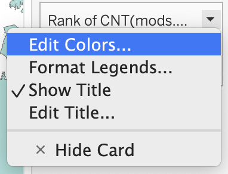
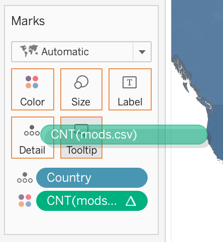
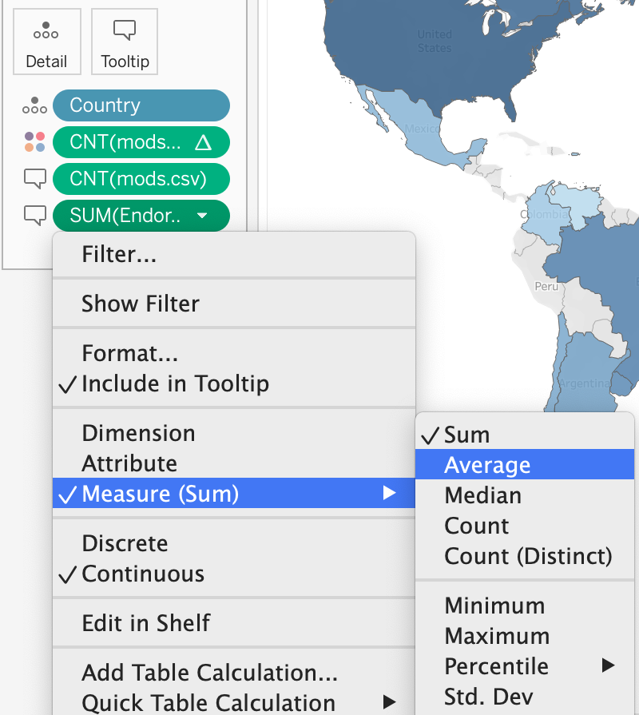
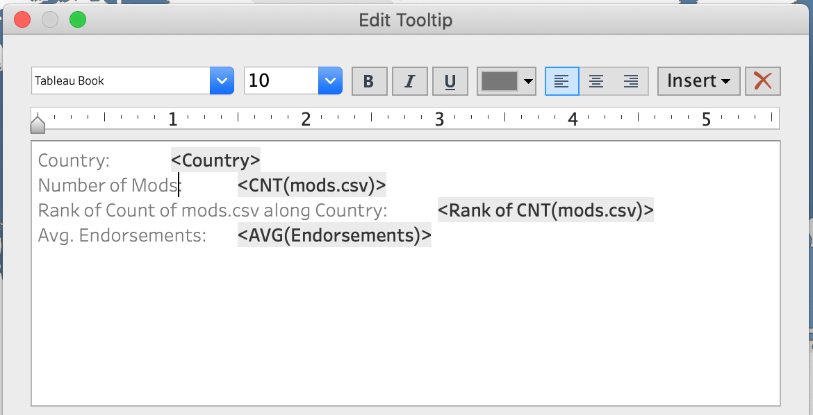
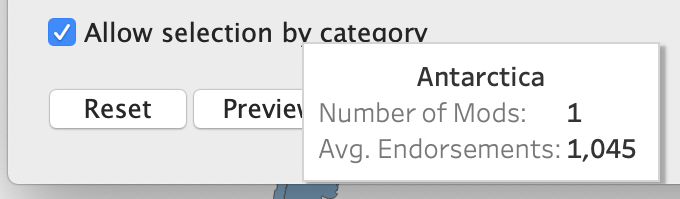

We will use formatting options to make our map both prettier and more useable. We will focus on what we can do with the legend, tooltip, and labels.

!!!! ## Learning Objectives
!!!! 
!!!! - Modify map colors.
!!!! - Edit the legend.
!!!! - Customize the tooltip.
!!!! - Add labels.

## Legend

What bothers me about this map is that the United States, at rank #1, is the lightest color, whereas I associate the darkest color with the highest rank. In fact, if we were still using the count of mods per country instead of the rank, the United States would be the darkest.

1. Find the legend at the top right of the worksheet, titled _Rank of CNT(mods.csv)_.

2. Hover over it and click the arrow that appears on the right side.
3. Choose _Edit Colors..._

!!! You can get the same result by clicking on Color in the **Marks** shelf and choosing _Edit Colors_.
4. Find the _Reversed_ checkbox and click it. Now rank #1 is the darkest.
5. Click on the _Palette_ dropdown. There are a number of different color schemes, some of which are marked with _Diverging_. 
! Note: Diverging color schemes are useful when there is a central point that all values are arranged around, creating two "categories" of value. For example: Positive vs. negative, good vs. bad, low vs. high. We do not need a diverging color scheme, but it is worth pointing out the _Red Green Diverging_ choice. Red and green are often chosen as two of the main colors in a visualization, but a significant portion of the population is red-green colorblind! When choosing multiple colors, always check to make sure that the chosen palette will be colorblind accessible.
6. While the Blue - Teal palette Tableau has set by default is acceptable, I prefer Blue and so have chosen that for this visualization. Feel free to pick whichever color you think is the most fun.

7. Click OK.

### Legend Title

While we are at it, we may as well change the title of the legend. _Rank of CNT(mods.csv)_ is not an ideal choice.

1. Hover over the legend again and click the arrow that appears on the right.
2. Choose _Edit Title..._
3. Type a more descriptive title into the text box that appears. I chose _Rank by Number of Mods_.

4. Click OK.

---

## Tooltip

If you hover your cursor over the various countries on our map, you will notice that an informative box pops up for each country from our dataset. It currently displays the Country and rank.

The tooltip is one of Tableau's most useful interactive features. It is automatically generated by Tableau as we add and remove various dimensions and measures. We can choose to add dimensions or measures directly to the tooltip. We can also modify the text of the tooltip itself. However, once we modify the text, Tableau will not know if automatically updating the tooltip might interfere with our changes. Some updates will still occur, but they may not be consistent or predictable. It is possible to reset the tooltip to Tableau's automatically generated one, but this would remove all of our changes. Therefore, never edit the tooltip text until  you are satisfied with the dimensions and measures displayed on your chart, but don't stress if you realize you do have to change something later after all.

### Adding Values to the Tooltip

We will start by making use of Tableau's automatic tooltip generation.

1. Locate _mods.csv (Count)_ from the **Data** sidebar.
2. Drag _mods.csv (Count)_ to the Tooltip box on the **Marks** shelf. The box will become lightly shaded, indicating that the selected measure is hovering in the correct location to be added.

3. Locate _Endorsements_ from the **Data** sidebar and drag it to the Tooltip box as well.
!!! Because Tableau automatically displays the sum of any measure we add in this manner, _Endorsements_ is calculating the sum of endorsements for all mods for each country. This means that the measure is heavily skewed by the number of records and is therefore not telling us anything particularly new or interesting. We can instead change it to the average to see how many endorsements a given country's mods receive on average.
4. Right click on _SUM(Endorsements)_ on the **Marks** shelf.
5. Choose _Measure (Sum)_ -> _Average_.

### Editing the Tooltip Text

Since we are satisfied with the measures we are displaying in the map, we should be ready to directly edit the tooltip text. Our goal here is to add clarity, remove irrelevant information, and make the tooltip look pretty.

1. Click on the Tooltip box on the **Marks** shelf. This will open up a dialog box allowing us to edit the text.
2. Change the label _Count of mods.csv_ to _Number of Mods_. This makes it clear to viewers what the value is measuring.

It is possible that the rows on your tooltip may not be in the same order as those shown in the screenshot. The order is up to you, so you can rearrange them to match or leave them as they are (or choose a completely new order).
! Note: Do not change `<CNT(mods.csv)>`. This phrase references the measure itself, so changing the name would confuse Tableau and cause errors.
3. (Optional) Remove the line for the _Rank of Count of mods.csv along Country_. If you do not remove this line you will want to rename it to something more readable. For example: _Rank by Number of Mods_.
4. Remove the label _Country_ and center `<Country>` by clicking the align center box on the top row of the tooltip editor.

5. Check how the new tooltip will look by clicking the _Preview_ button on the bottom left. Note that this is right next to the _Reset_ button.

6. Click OK.

### A Final Tooltip Note

A final note: Try hovering over the United Kingdom and examine the tooltip that pops up. It will list the country as either England with 2 mods, United Kingdom with 267, or Wales with 3.

This is because when we mapped England and Wales to the UK, we did not actually change the data. Even in this case it might have been preferable to use a data cleaning tool to change England and Wales to United Kingdom so we would have more consistent data.

## Labels

! This section is optional. We will test out labels, but we are not going to end up changing anything in the visualization.

We can also consider adding labels to the various countries on our map.

1. Click on the Label box on the **Marks** shelf.
2. Click the checkbox for _Show mark labels_.

3. This displays the rank for each country and is unnecessary. Undo the operation (Windows: control-Z or Mac: command-Z).
4. We can choose our own labels instead. Drag _Country_ from the **Data** sidebar onto the Label box.

5. This is excessively messy. Undo the operation.