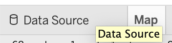
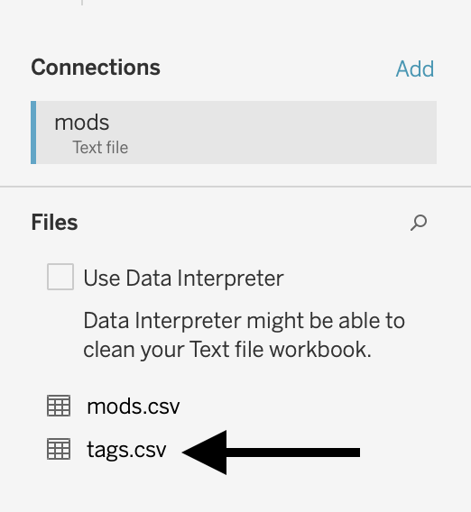
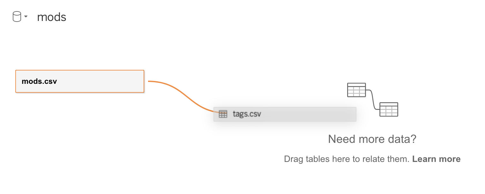
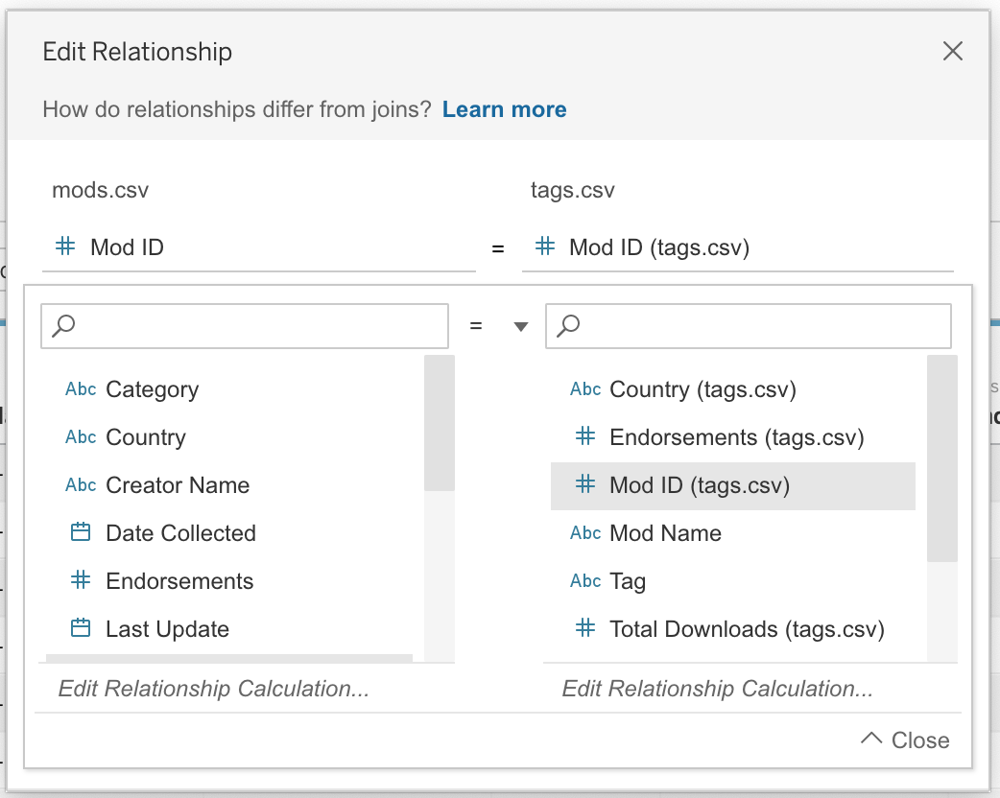
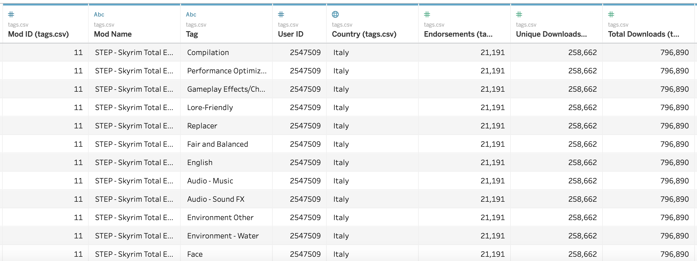
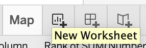
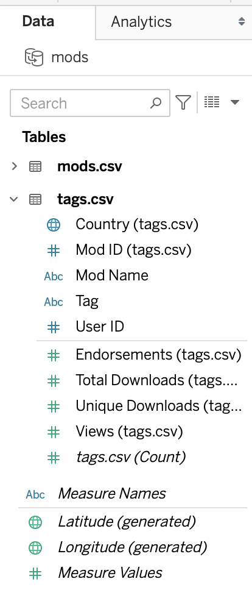
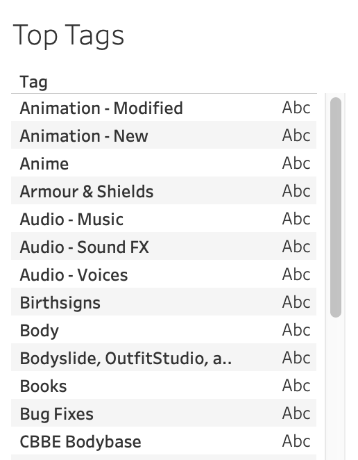
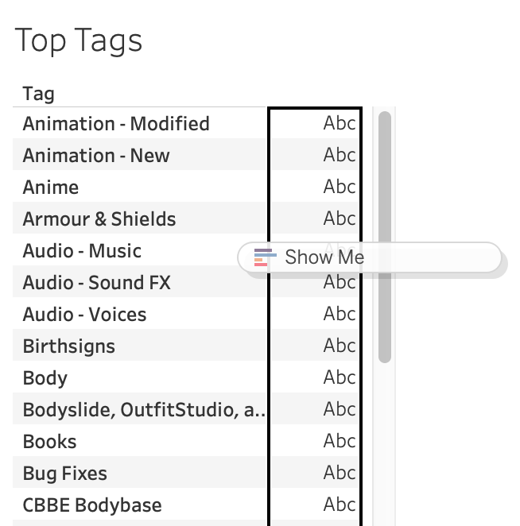
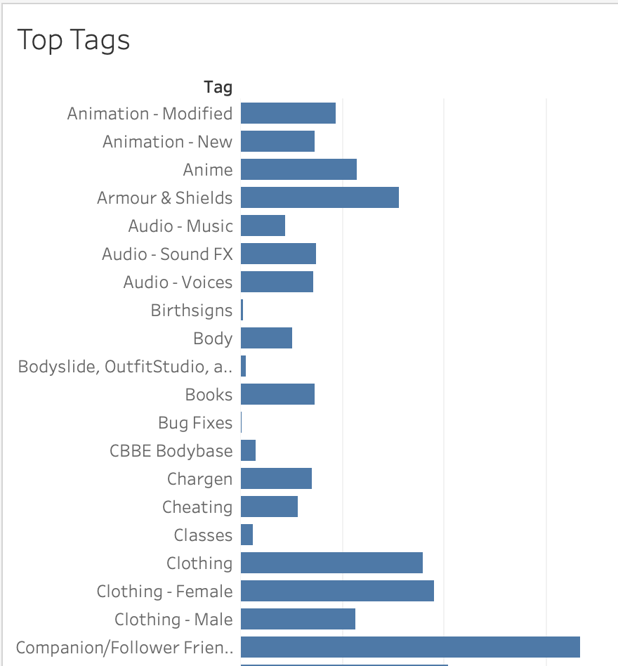

Our goal in this section is to see which tags are most popular. Each mod may have many tags associated with it, so the required data is stored in a different file in our dataset: tags.csv.

!!!! ## Learning Objectives
!!!! 
!!!! - Work with multiple data sources at once.
!!!! - Join datasets.
!!!! - Create a simple bar chart.

## Multiple Data Sources

Because the tag data we want to use for our bar chart is stored in a different file, we need to know how to work with multiple data sources. Because tags.csv is in the same folder as mods.csv, this will be fairly straightforward.

1. At the bottom left of the application, click on the "Data Source" tab.

2. Find tags.csv below mods.csv under **Files** in the left section.

3. Drag tags.csv onto the top section where it says: "Need more data? Drag tables here to relate them. Learn more." The exact spot where you drag it doesn't matter. This will add a tags.csv box, connected to the mods.csv box with a warning symbol.

4. Tableau will now ask us to define the relationship between mods.csv and tags.csv so that it knows which row from the mods dataset holds the relevant data for a given row from tags. Because Mod ID is a unique identifier, it is the perfect choice for something like this. Choose _Mod ID_ from mods.csv on the left and _Mod ID (tags.csv)_ from tags.csv on the right.

5. Click the X at the top to close.

Tableau will now show us the data from tags.csv, like it did when we connected to mods.csv. Many of the columns are the same as what we have seen before, but there is now a column for _Tag_. There are also many instances of the same mod. For example, the mod with ID 11 has multiple rows, one for each tag associated with the mod.

If you are familiar with the concept of joins, what we have done is somewhat similar. By telling Tableau how mods.csv and tags.csv are related, Tableau is now equipped to join the two tables in whatever way we need without any additional input. If you are not familiar with joins, there is no need to be, because Tableau is handling all of this behind the scenes.

Having these two tables related will allow us additional filter functionality later on. We could create our bar chart with only the data from tags.csv, but by relating that data to the mods.csv data, we can relate the bar chart we will make with our map and any other visualizations we create.

## Bar Chart

Now that we have added tags.csv, our goal is to use this data to show the top twenty tags for mods. We will start by creating a simple bar chart for all tags.

1. Click the _New Worksheet_ button on the bottom panel of the application (to the right of the tab for the _Map_ worksheet and the left of the buttons for _New Dashboard_ and _New Story_).

2. Right click _Sheet 2_ and rename it something more descriptive, like _Top Tags_.
3. Note how the **Data** sidebar has changed. **Tables** now has two sections, one for mods.csv and one for tags.csv. We can expand or collapse these fields by clicking the caret to the left of the file names. Right now we are interested in the data from tags.csv, so we may as well collapse mods.csv for convenience.

4. Locate _Tag_ under _**tags.csv**_ and drag it onto the blank worksheet. The sheet will display a list of the various mod tags along with some placeholder text _Abc_.

We also want to see how many mods are associated with each tag.

1. Locate _tags.csv (Count)_. We earlier discussed how _mods.csv (Count)_ means the same thing as the number of mods. Likewise, _tags.csv (Count)_ means the number of tags. However, for each tag, the same mod will only ever be listed once. That is, no mod-tag pair from tags.csv will be the same as any other. This means that _tags.csv (Count)_ provides the number of mods associated with a given tag.
2. Drag _tags.csv (Count)_ on top of the _Abc_ placeholder text. (The column with the placeholder text will show a black outline when you hover over it with _tags.csv (Count)_.)

3. Click on the **Show Me** tab on the top right and choose the _bar chart_ option. It should have a red/orange outline, which means that it is the recommended chart type.

We have a bar chart displaying the information we want - how many mods use each tag.

