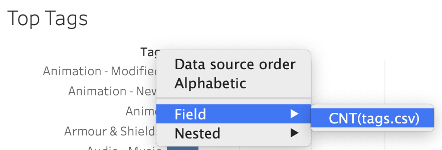
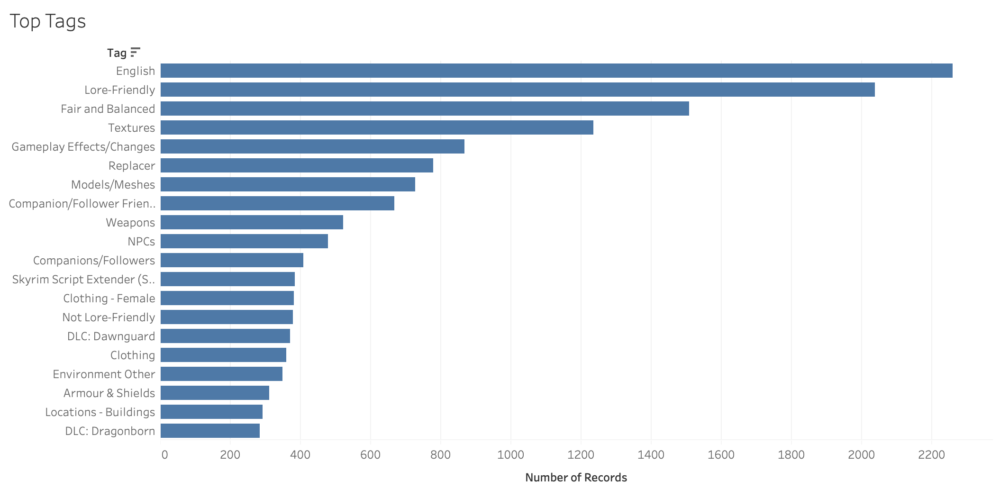
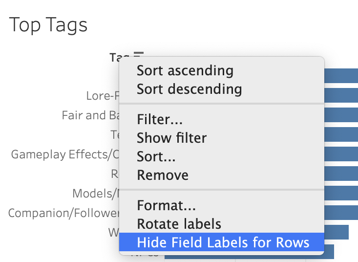
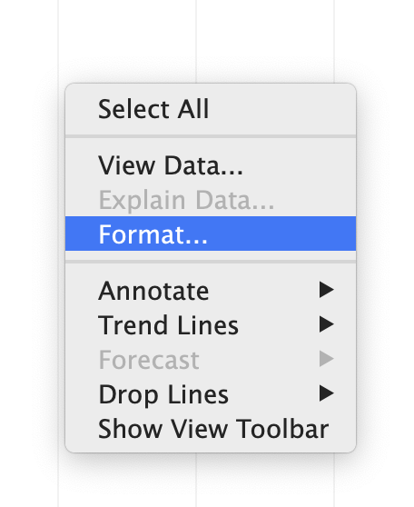
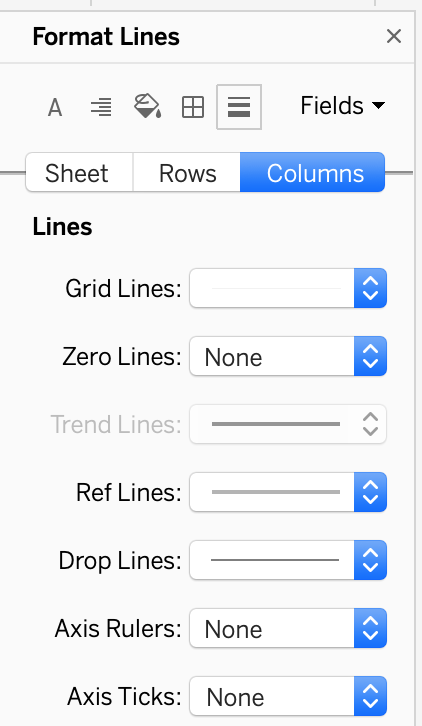

We have a simple chart showing how many times each tag in our dataset is used. With a little work we can turn this into a very nice bar chart showing only the top tags.

!!!! ## Learning Objectives
!!!!
!!!! - Sort a bar chart.
!!!! - Apply a "top" filter to a worksheet.
!!!! - Add formatting to a bar chart.

## Sorting

Since we want to see the top tags, it makes sense to sort our bar chart to show the most common tags at the top. In fact, as a general rule it makes sense to sort bar charts in increasing or decreasing order. The main exception would be if the categories (in this case tags, but they could be anything) have a natural order that would be unwise to break up. As our list of tags has no such order, we want to sort it.

1. Hover over the "Tag" label (above the bar chart) and click on the arrow that appears. Since "Tag" is such a short word, almost the whole label will be covered by the dropdown arrow.

2. Choose _Field_ -> _CNT(tags.csv)_ to sort based on the number of mods using each tag.

## Filtering

While we can see which tags are the most popular, the bar chart is still displaying all of the tags, and there are quite a lot. We can simplify this by having Tableau filter out everything except the top twenty we want to see.

1. Locate _Tag_ from tags.csv on the **Data** sidebar, and drag it onto the **Filters** shelf.
2. In the popup menu, go to the _Top_ tab on the far right.
3. Choose the option for _By field_.
4. The default should be Top 10 by tags.csv Count. This is almost exactly what we want. Change the 10 to 20.

5. Click OK.

The filtered chart:

## Formatting

Finally, we want to add some formatting to make our chart prettier and more useable. The types of formatting we can do with a bar chart (and many other similar types of charts) are very different from what we can do with a map. For this chart we will focus on removing distracting or extraneous information.

Edward Tufte, a famous figure in data visualization, coined the term "chartjunk" in his book _The Visual Display of Quantitative Information_. In essence, chartjunk is unnecessary ink that distracts a viewer from the information presented in a visualization. We have quite a bit of chartjunk we can remove from this visualization. We can remove an extraneous label, the unnecessary grid lines, and the bottom axis.

!!! If you would like more information about how to design visualizations, I strongly recommend reading [The Visual Display of Quantitative Information](https://ou-primo.hosted.exlibrisgroup.com/primo-explore/fulldisplay?docid=NORMANLAW_ALMA21341430150002042&vid=OUNEW&context=L&lang=en_US) by Edward Tufte. It is currently on reserve at Bizzell Memorial Library, which means you can ask for it at the front desk and check it out for four hours at a time. Tufte, E. (1983). _The Visual Display of Quantitative Information._ Graphics Press.

!!! There is also a [copy of Tufte's book available online from the Open Library](https://openlibrary.org/works/OL2824012W/The_Visual_Display_of_Quantitative_Information).

1. At the top of the bar chart, note the word "Tag" above the row labels (this is the label we hovered over to sort the chart). We can remove this extraneous label.
2. Right click on "Tag" and choose _Hide Field Labels for Rows_.

! If you ever want to show a field label you have hidden, you can go to top menubar and choose _Analysis_ -> _Table Layout_ -> _Show Field Labels for Rows_.
3. Next we will remove extra grid lines. Right click on a blank area of the worksheet and choose _Format..._.

4. On the formatting tab that appears on the left there is a list of five symbols. Click on the lines symbol.

5. Change _Grid Lines_ to _None_. The dropdown already says _None_, but this is incorrect because manually changing it removes lines. Note that the dropdown provides additional options for line style, width, and color.

6. For good measure, set _Zero Lines_, _Axis Rulers_, and _Axis Ticks_ to _None_ as well.
7. Unfortunately, this change is deceptive. Under **Format Lines**, choose **Columns** instead of **Sheet**. The _Grid Lines_ dropdown here is not set to _None_!

8. Change _Grid Lines_ to _None_ here as well.
! When I first made and saved a bar chart, I was very surprised to see that the saved visualization still showed grid lines despite having set the **Sheet** lines to _None_. It took a bit of experimentation and exploration until I found the problem with the **Column** lines.
9. Right click anywhere on the bottom axis and click _Show Header_ to uncheck it.
