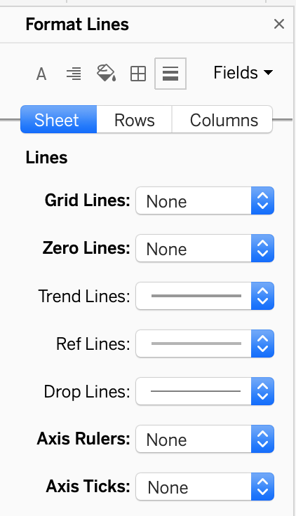

We will now apply several formatting options to make the scatter plot cleaner and easier to use. We will format the points, remove unnecessary grid lines, modify the tooltip, and edit our axes.

!!!! ## Learning Objectives
!!!! 
!!!! - Format scatter plot points.
!!!! - Format chart axes.

## Data Points

The circle outlines we are currently using for our data points feel very cluttered to me. Changing them to a simpler shape would make it easier to examine the visualization and understand what is happening. Something the outlines do very well, however, is indicate where there is a lot of point overlap. In the center the overlap is so extreme that we basically have a solid blue blob. If we use a simpler shape, like solid circles, such a blob would not have the same meaning, since we could achieve it with far fewer mods. We will mitigate this slightly by making our points partially transparent. That way we will see darker areas where there is overlap.

1. Click on the Shape box in the **Marks** shelf.
2. Choose your preferred shape. I picked the solid circle, as I find it a lot cleaner than the circle outline, but you can pick whatever you like best.

3. Click on the Color box in the **Marks** shelf. There are options for color, opacity, and effects.
4. Change the opacity to 40%. At this level of opacity, it is still easy to show single data points like SkyUI while indicating areas of considerable overlap.

## Grid Lines

As with the bar chart, we have unnecessary grid lines - chartjunk. We will remove these.

1. Right click any blank space on the worksheet and choose _Format..._.
2. Click on the _Lines_ symbol near the top of the **Format** section that replaces the **Data** sidebar.
3. Make sure the _Sheet_ tab is selected, as opposed to the _Rows_ or _Columns_ tabs.
4. Set Grid Lines, Zero Lines, Axis Rulers, and Axis Ticks to _None_.

! Note that this time we do not need to switch to the _Columns_ tab to change Grid Lines there. If you check, you will see that Grid Lines is already set to _None_. It would seem that the issue we had with bar charts is not an issue for scatter plots.
5. Click the X at the top right of **Format Lines** to return to the **Data** sidebar.

## Tooltip

The biggest issue with our tooltip is that it currently displays Mod ID in addition to endorsements and total downloads. Although Mod ID is useful for telling Tableau how to group and plot our data, it is not a particularly meaningful value, either to us or our audience. Mod name would be much more informative and interesting.

1. Locate _Name_ from the **Data** sidebar and drag it onto the Tooltip box on the **Marks** shelf.
2. Click on the **Tooltip** box and remove the line displaying the Mod ID. There is no reason to have this cluttering out tooltip when it is not useful.
3. (Optional) Remove the label for _Name_ and center the value, as we did with _Country_ in the map tooltip.

4. Click OK.

## Axes

Finally, we will make a few edits to the axes. There are two main changes worth making. The first is making the range fixed. The Endorsements range (y-axis) currently goes up to somewhere between 700,000 and 800,000, but if we filtered the dataset, perhaps showing only mods with the category _Books and Scrolls_, the endorsements range would adjust to better fit that limited dataset. Without taking note of the changed range, it would look like mods from _Books and Scrolls_ had more endorsements (and total downloads) than they actually did. Keeping the range fixed will eliminate this problem. It does mean we may be left with extra whitespace depending on what subset of mods we are looking at, but I find this a small price to pay.

The other change we will make is to the axis ticks themselves. We have a tick mark every 100,000 endorsements, making for a fairly busy axis. These extra tick marks are not really helping us or our viewers, however. As long as I have a general idea of the range, that is good enough to estimate what is happening in the scatter plot. If I want to know exactly how many endorsements or downloads a mod has, I can hover over the data point and examine the tooltip. We will therefore set larger gaps between tick marks.

1. Right click on the y-axis (_Endorsements_) and choose _Edit Axis..._.

2. In the _General_ tab, set the **Range** to _Fixed_. There is no need to change the default values.

3. Switch to the _Tick Marks_ tab.
4. Set the **Major Tick Marks** to _Fixed_. Here we are less concerned about having them change on us (since the range will not change), but we cannot define the tick interval without choosing this setting.
5. Change the _Tick Interval_ to 250,000.

6. Click the "X" symbol at the top right of the menu to dismiss it.
7. Right click the x-axis (_Total Downloads_) and choose _Edit Axis..._.
8. Set the **Range** to _Fixed_. There is no need to change the default values here either.

9. Switch to the _Tick Marks_ tab and set **Major Tick Marks** to _Fixed_. There is no need to change the tick interval this time, since it defaults to 10 million.

10. Close the window.

## Finished Plot

