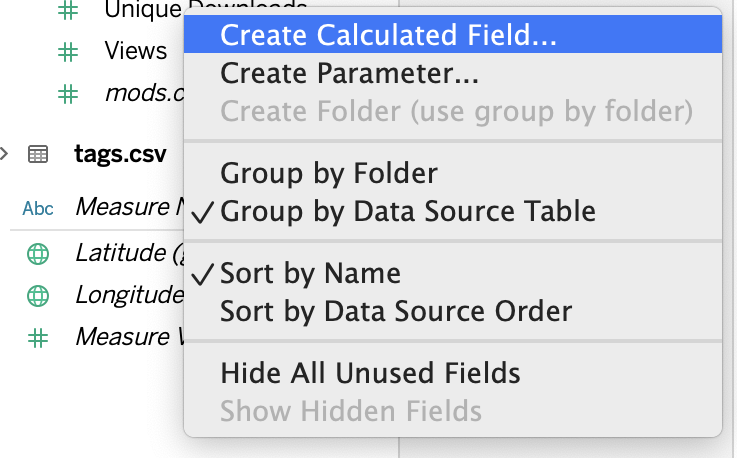
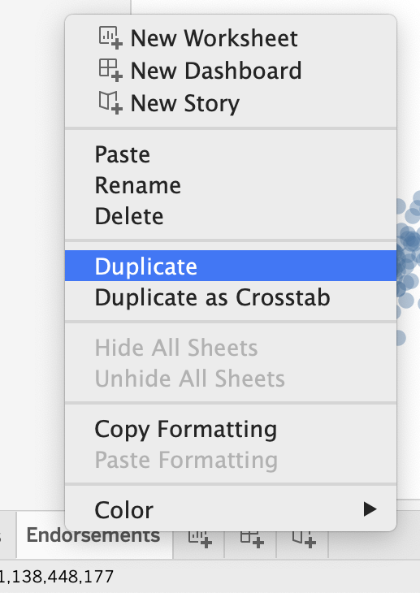
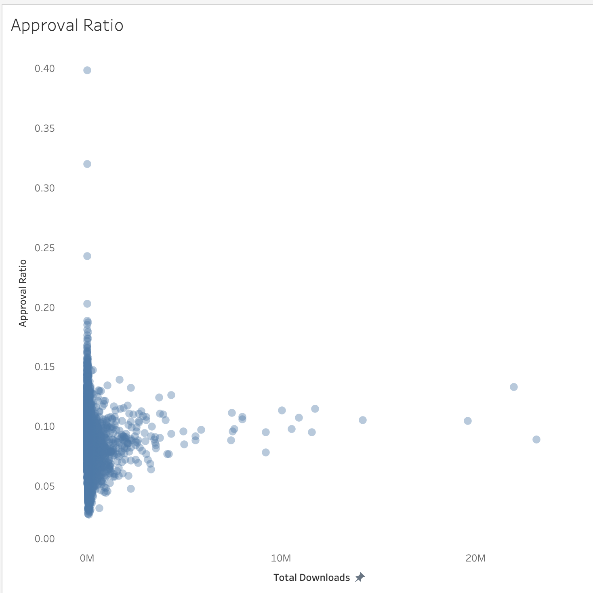
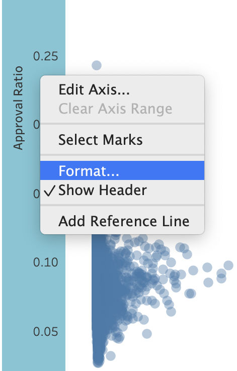

As we can see, endorsements are indeed closely correlated with total downloads. While there is some variation, there is not a lot. It could be more interesting to see how the percentage of people who endorsed the mod compares to total downloads. We do not have a field that provides this percentage, so we will have to create a new field. We can do so by dividing _Endorsements_ (number of people who have endorsed the mod) by _Unique Downloads_ (the number of people who downloaded the mod). This will work because a user can only endorse a mod once, and they can only do so after they have downloaded the mod. Unlike total downloads, unique downloads will not be affected by any subsequent downloads by the same user.

!!!! ## Learning Objectives
!!!! 
!!!! - Create a calculated field.
!!!! - Duplicate a worksheet.
!!!! - Format axis number display.

## Calculated Field

1. Either right click on the empty bottom area of the **Data** sidebar or click on _Analysis_ from the file menubar.
2. Choose _Create Calculated Field..._.

4. In the text box at the top of the popup menu, change the name to _Approval Ratio_. The larger text area in the popup menu is where the calculation for the field will go. If we wanted to create something very fancy, we could look up how to write code in Tableau, but that kind of manipulation will likely never be required. For simple calculations, Tableau's drag-and-drop interface comes to the rescue once more.
5. Locate _Endorsements_ from the **Data** sidebar and drag it onto the box. The text `[Endorsements]` will be shown.

! Technically, typing "Endorsements" with brackets is not particularly complicated, but I would not have remembered the required format without dragging and dropping _Endorsements_. Most likely, I would have wanted to default to how Tableau references fields in the tooltips. If you are confused as to why the required format for the tooltip is different from that of the calculated field, consider what is being referenced in each case. The tooltip is not referencing the field from the dataset itself, but rather the field as it relates to the particular worksheet. For example, the tooltip might provide the sum or average endorsements, calculations that will be defined by aspects of the worksheet. Is the sum of endorsements the sum of all endorsements or the sum of all endorsements for a given category or country? A calculated field, however, is not unique to the worksheet we are on when we create it, which is why we did not start by creating a new worksheet. It must therefore reference the field itself.
6. Type the "/" symbol to indicate division.
7. Locate _Unique Downloads_ from the **Data** sidebar and drag it onto the box as well. The formula should be: `[Endorsements]/[Unique Downloads]`.
![Calculate field: [Endorsements]/[Unique Downloads].](03.finished-field.png?cropResize=650,700)
8. Click OK.

## Duplicate Scatter Plot

Now that we have a field to plot, we need to create a new scatter plot. As there is no need to reinvent the wheel, so to speak, we will duplicate our current scatter plot instead of starting from a blank slate. It would be a shame to have to redo all of our formatting for the new plot.

1. Right click on the _Endorsements_ worksheet tab at the bottom of the application and select _Duplicate_.

2. Right click on the duplicated worksheet tab and rename it to _Approval Ratio_.

Our approval ratio scatter plot is still showing endorsements and total downloads, but we want to replace endorsements with our new calculated field. One method of doing this could be to remove _Endorsements_ from **Rows** and then add _Approval Ratio_. Alternatively, we could add _Approval Ratio_ first and then remove _Endorsements_. We will go with an even simpler option.

1. Locate _Approval Ratio_ from the **Data** sidebar.
2. Drag it on top of _Endorsements_ in **Rows**. The orange arrow/triangle that normally appears when we add fields should not be visible. Instead, _Endorsements_ should have a black outline indicating that we are replacing it with _Approval Ratio_.

This plot will have a very different distribution than the Endorsements scatter plot. Instead of a diagonal line indicating strong correlation between total downloads and endorsements, we see that approval ratio has quite a bit of variation with low download values, then levels off for mods with higher numbers of downloads.

## Formatting

We have a few things that we need to clean up after replacing _Endorsements_ with _Approval Ratio_ as some of our formatting options have been undone. Fortunately, most of the formatting we applied in the first scatter plot remains, so we do not have to do too much work to finish this one.

1. Right click the y-axis (_Approval Ratio_) and choose _Format..._ this time instead of _Edit Axis..._.

2. Locate the Scale section on the **Format** tab that appears on the left.
3. Click on the Numbers dropdown.

4. Change from _Automatic_ to _Percentage_, since our approval ratio is the percentage of users who endorsed the mod after downloading it.
5. Change the number of decimal places from 2 to 0.

6. Right click on the axis again and this time choose _Edit Axis..._.
7. On the **General** tab, set the Range to _Fixed_.

8. Switch to the **Tick Marks** tab and set Major Tick Marks to _Fixed_ as well.
9. Change the tick interval from 0.1 to 0.2.

9. Close the window.

## Finished Scatter Plot

