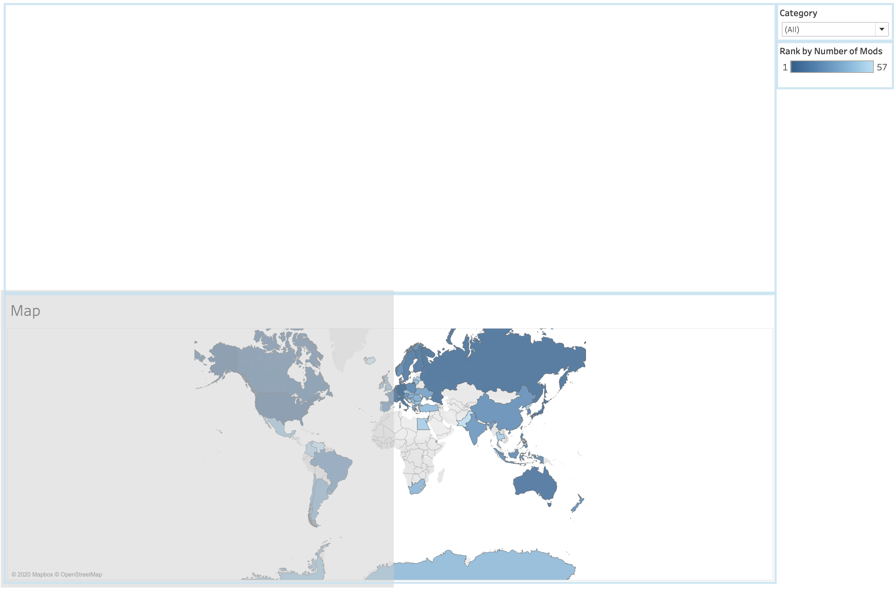

By this point we have created a map, a bar chart, and two scatter plots. It is time to put them together by creating a dashboard. A dashboard will allow us to create a comprehensive visualization where charts and filters interact with each other. For example, the Category filter we added to the map could also filter the data in the bar chart and scatter plots. With filters, we could answer questions like: What are the top tags for mods from Germany? or How popular are "models and textures" mods?

We will start by adding all of our worksheets to a new dashboard and arranging them. Much of this section is subjective, so do not feel compelled to give your worksheets the same positions and sizes as the ones shown. The goal is to have all of the worksheets in one space. The worksheets provide very little data on their own compared to how much information they provide when given the context of all the others.

!!!! ## Learning Objectives
!!!!
!!!! - Create a dashboard.
!!!! - Add worksheets to a dashboard.
!!!! - Change worksheet size and position.
!!!! - Add a non-worksheet object to a dashboard.

## Creating a New Dashboard

1. Click the _New Dashboard_ button (between the _New Worksheet_ button and the _New Story_ button at the bottom of the application).

2. Right click _Dashboard 1_ and rename it to _Mods Dashboard_ (or any other descriptive name).

By default, Tableau has provided a range for the minimum and maximum height for displaying the visualization. If it is given more space than the maximum, that extra space will not be filled, and if it is given less space than the minimum we will have to scroll to view the whole visualization. Beyond those extremes the visualization will adjust its size to accommodate our own screens. We can modify the minimum and maximum values for the range, or we can change to a fixed or automatic size instead. Fixed is inflexible and will rarely, if ever, be our best option. Automatic is the most flexible. It means the visualization will fill whatever size screen it is given. This can be convenient, but it does have its drawbacks. Both automatic range options will change the proportions of the various worksheets depending on the width and height of a given viewer's screen. Further, the automatic size could cause problems with particularly small screens if the visualization needs to be a certain size to be seen clearly. At a certain point it is better to require scrolling than to shrink the visualization. A range allows that minimum size to be specified, while still allowing for automatic readjustment within the minimum and maximum values provided.

Locate the **Size** section on the left. It should say something like _min 420x560-max 650x8..._. Clicking on the arrow to the right of the provided range will open a dropdown menu where we can change the minimum and maximum values for the range. The arrow next to the text _Range_ will open a second dropdown that allows us to switch between fixed sizes, a range, or automatic sizing. In general your best option will be a range. You don't need to worry much about the minimum size - Tableau's default is pretty good, and it handles sizes for phone screens separately. I'm not all that concerned about maximum size, however. I will keep _Range_ selected, but I will uncheck the box next to _Maximum size_.

## Adding Worksheets

Take note of the **Sheets** section on the left, which contains a list of all of our worksheets. We will add worksheets to our dashboard from here the same way we added dimensions and measures to the worksheets. 

! I often catch myself trying to drag worksheets from the tabs at the bottom of the application. This changes the view from the dashboard to the selected worksheet, however, which is not very helpful.

1. Drag _Map_ onto the empty dashboard. The worksheet will fill up the entire space.
2. Drag _Top Tags_ onto the dashboard. You will see different areas become highlighted depending on where you position it. Tableau arranges items on dashboards as tiles, so this highlighted portion is indicating where the _Top Tags_ tile would go. Drop the worksheet onto the top half of the dashboard to see what that looks like.

Unfortunately, this is not the ideal location for the bar chart. _Top Tags_ could use more height than width, so we will have to rearrange the worksheets.

### Rearranging Worksheets

Fortunately, we can move tiles around on the dashboard as much as we want. The first step to move a dashboard is to select it. A selected worksheet will be outlined in dark gray, and a tiny menu will become available on one of the sides. Most importantly, a small gray box with white lines will appear in the top center. Hovering over this box changes the cursor into arrows. Clicking and ragging the box allows us to move the worksheet (or any other object/tile added to a dashboard).

1. Make sure that _Top Tags_ is selected and find the box in the top center.

2. Instead of having the bar chart on top of the map, we want the bar chart and map to be side by side. Click on the gray center box and drag the _Top Tags_ tile to the left side of the dashboard. While dragging, it may look like the bar chart will only be added to the bottom left corner, but both the bar chart and map will resize to take up the full space of the dashboard.

It is not perfect, but it does look a lot better.

### Adjusting Sizes

Our visualization would look better if the map were given more space. This time we don't want to move a tile on the dashboard, but we do want to adjust its size. Hovering over the line between _Top Tags_ and _Map_ in the dashboard should turn the cursor into arrows indicating the direction of movement available. In this case the arrows point left and right to indicate that we can click and drag the bar to the left or to the right. We want _Top Tags_ to have less space (or more to the point, we want _Map_ to have more), so we will drag the bar to the left.

Now we have seen how Tableau treats worksheets as "tiles," how to move those tiles around, and how to adjust the sizing of our worksheets. Our next step is to add both scatter plots. In the screenshot below I have added both scatter plots side-by-side below the map. Wherever you choose to add them, you can experiment by moving them around until you like the arrangement. You may also notice that I increased the height of the map after adding the scatter plots, as by default they would take up a full half of the available height.

## Adding Non-Worksheet Objects

On the left of the application (below **Size** and **Sheets**), take a look at the **Objects** section. This is where we can add additional tiles, like text boxes and images, to our dashboard. We want to add a _Text_ object to provide a link to the source of the data we are visualizing.

We can add objects the same way we add worksheets - by clicking and dragging them onto the dashboard. I decided to put the text object above the _Top Tags_ bar chart, but you can add it wherever you prefer. However, after dragging the text object where we want it, the dashboard does not change immediately. We must first provide the text we want to show. Although we could leave the text blank and edit it after adding the object, we may as well add our text now and save a step later.

Text to add: `CLIP: Data from: https://github.com/ou-ds-data/skyrim-mods`

After clicking OK we can see the object we added.

## Final Adjustments

The category filter and map legend don't require much height, but they have an entire column to themselves on the right, assuming your setup looks like mine. To minimize empty space, I moved both of those tiles to the same column as the text box and bar chart. I also adjusted the sizing, mostly to make sure that the bar chart was a little bit taller. I prefer not to have to scroll to see all twenty top tags. Of course, if I viewed the visualization with a smaller screen I might still have to, but at least I can minimize the amount of scrolling required.

Notice that moving both filter and legend means that the right column has disappeared, which means more space for the rest of our visualization. Note also that the _Endorsements_ scatter plot is now wider than the _Approval Ratio_ scatter plot. Clearly, my dashboard could benefit from a bit more adjusting.