Interactive filters will allow our viewers to explore the data and engage with the visualization. We added one for _Category_ to our map, but it currently only filters the map. It would be nice to apply the category filter to all the visualizations on our dashboard, and to use the map itself as a filter. We will also do a little bit of formatting to deal with the titles of our worksheets.

!!!! ## Learning Objectives
!!!!
!!!! - Use a worksheet as a filter.
!!!! - Apply a worksheet filter to an entire dashboard.
!!!! - Add filters to context to fix filter ordering issues.
!!!! - Hide or change worksheet titles on a dashboard.

## Turning a Worksheet into a Filter

In Tableau, it is possible to turn a whole worksheet into a filter for a dashboard. For example, if we make _Map_ a filter, then clicking on a country will filter the data to only display mods from that country. This way our map will not only provide information, but also serve as a filter at the same time.

Start by clicking on the _Map_ tile to make sure you have it selected. At the top on one of the sides there will be a small list of options starting with an _X_ and ending with a downward arrow. Just above the arrow is a funnel icon, which is what we are looking for. Hovering over it produces the text: _Use as Filter_. Clicking on this will turn the map into a filter.

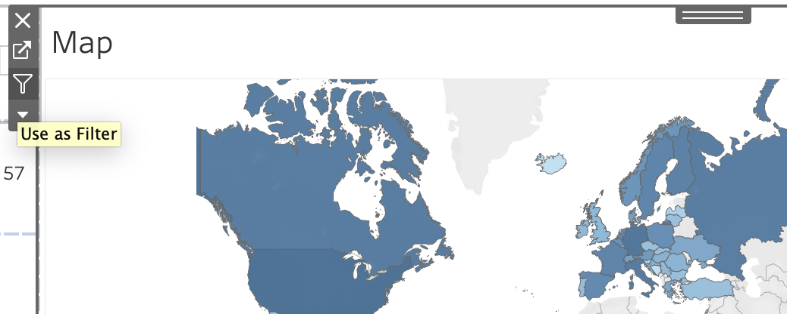

If you hover over the downward arrow below the funnel icon, you will see the text: _More Options_. Clicking on this arrow will open up a dropdown menu where one of the options is _Use as Filter_. If you have already clicked on the funnel icon, your dropdown menu will show a checkmark in front of this option.

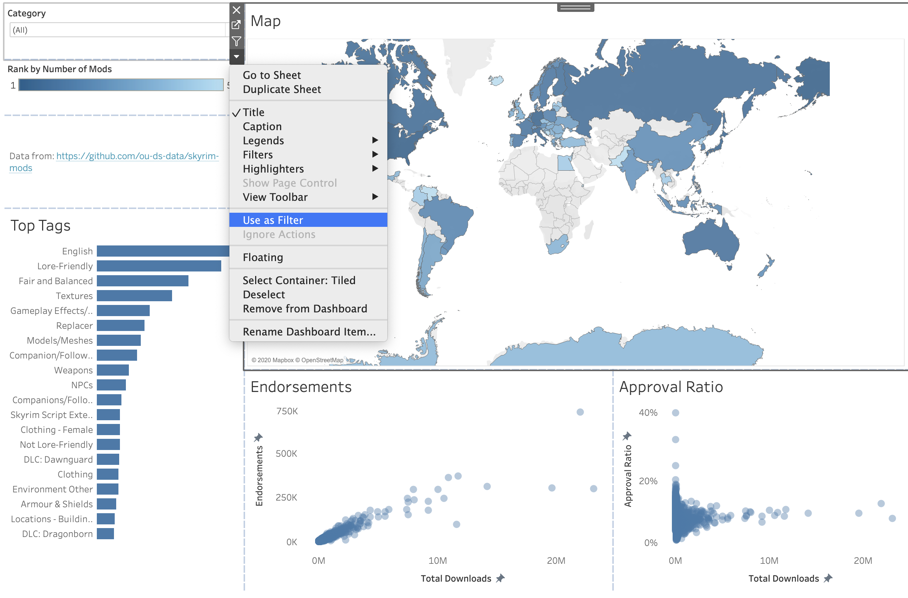

You can try out the filter to see how clicking on various countries changes the rest of the dashboard. If you want to include mods from several countries, you can hold command (control for Windows) while clicking each country you want. When you are finished filtering, you can click any open spot on the Map worksheet to dismiss your selection(s).

You can turn any worksheet into a filter - this method will also work with the bar chart and scatter plots we created. I would recommend waiting until you have finished the tutorial until you try it, however, just in case.

## Applying a Worksheet Filter to a Dashboard

While we were able to turn the map into a filter, this did not connect the _Category_ filter to the rest of the dashboard. That is, if I select a category, the view on the map will change, but none of the other worksheets will be affected. We will have to change the filter behavior ourselves.

1. Click on the _Category_ filter and note the list of options on the top left or top right. This will be shorter than the map's list: Only an _X_ and an arrow.
2. click on the arrow for _More Options_.
3. Choose _Apply to Worksheets_ -> _Selected Worksheets_. This will allow us to decide which worksheets we will apply the filter to. Note that _Only This Worksheet_ was the previous selection.
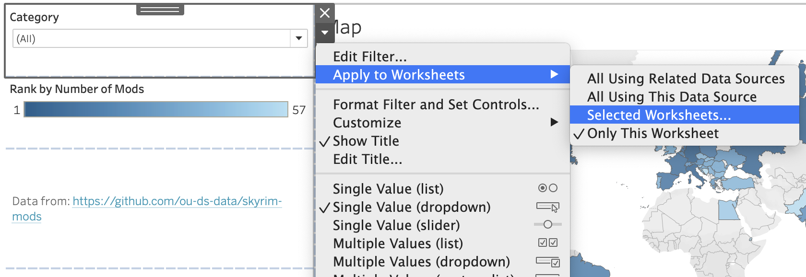
4. In the window that pops up, click the button for _All on dashboard_. It will automatically check the boxes for each of the worksheets listed. We could check each box manually, but this option is more convenient.
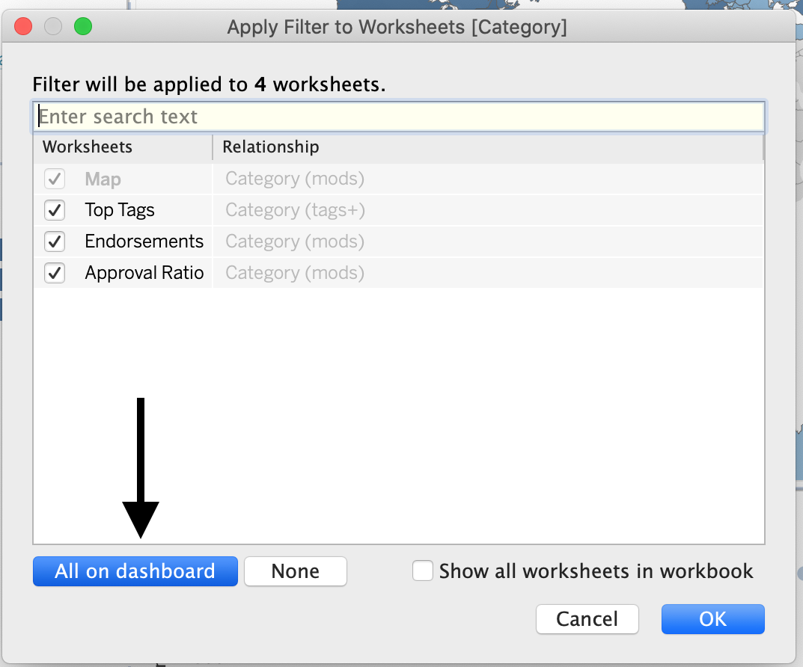
5. Click OK.
6. Select a category from the dropdown menu and see how it filters everything on the dashboard now, not just the map.

## Filter Issues

Working with filters can be somewhat complicated. At the moment there is an issue with the filters on our dashboard, though it may be difficult to notice if you don't know exactly what to look for.

1. Pick a category from the _Category_ filter. I chose _Models and Textures_.
2. Click on a country on the map. I clicked on the USA.
3. _Top Tags_ is behaving strangely. With the filters I chose there are only nineteen tags displayed.
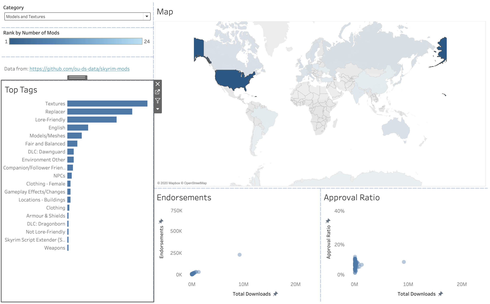

What's going on? If only a few mods met my filter requirements, I might be inclined to say that there were only nineteen tags to pick from. However, the country and category I chose should leave me with enough mods that this potential explanation feels incorrect. In fact, what is happening is simply a result of the order we are applying each of our filters.

There are currently three filters being applied to the top tags bar chart. First, the filter we set when we created the bar chart is applied. This narrows our list of tags to the top twenty. From that list, we then apply the country and category filters. Thus, while the top twenty tags for our subset of mods may include different tags from the initial top twenty, only those initial twenty tags are considered. Instead, we want to apply the country and category filters _before_ we limit our bar chart to twenty tags.

### Fixing Filters for Top Tags

It is possible to adjust the order we apply filters to our data, but not from the dashboard. We need to go back to the _Top Tags_ worksheet by clicking on the tab at the bottom of the application. Of the three filters on the **Filters** shelf, we want to add Action(Country) and Category to context. Adding a filter to context is a fancy way of telling Tableau to apply that filter first.

1. Make sure you are on the _Top Tags_ worksheet.
2. Right click on the _Category_ filter on the **Filters** shelf.
3. Choose _Add to Context_. The filter will change from teal to gray.
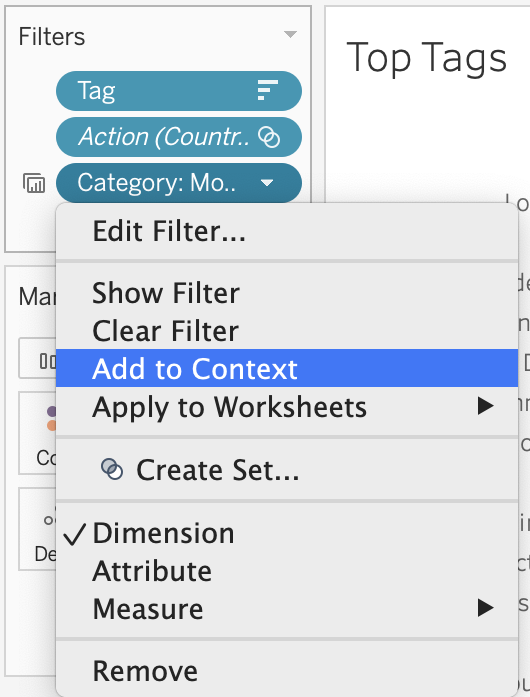
4. Do the same thing for the _Action(Country)_ filter. The **Filters** shelf should show _Action(Country)_ and _Category_ as grayed out. The final filter, _Tag_ should still be teal, as it has not been added to context.
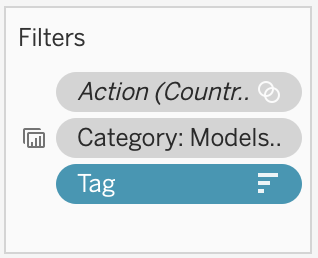
5. Go back to the dashboard. _Top Tags_ should now show twenty sorted tags.
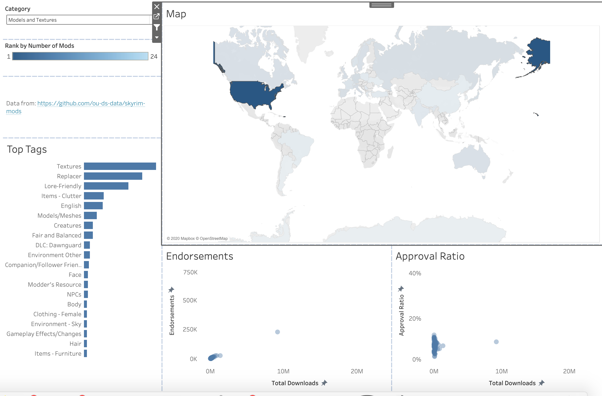

### Fixing the Category Filter

We have fixed _Top Tags_, but we still have an issue. Clicking on the _Category_ filter reveals that the second option (just below _(All)_) is _Null_. This is particularly distressing after all the work we did to add a null category filter and only display relevant values in the filter.

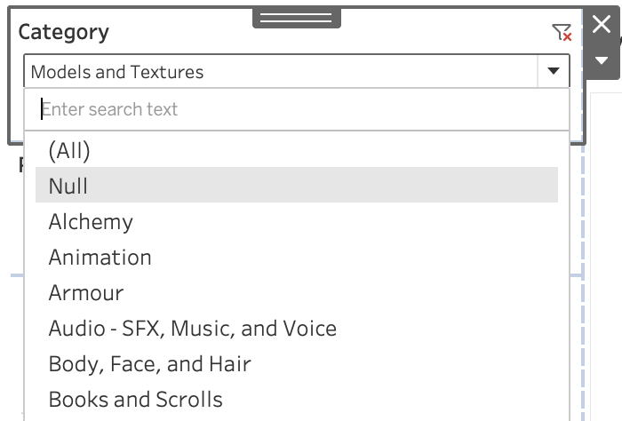

To illustrate why we do need to fix this, try selecting _Null_. While their stats are displayed in the bar chart and scatter plots, the map goes completely blank. Leaving _Null_ available to our viewers does not seem like a good option.

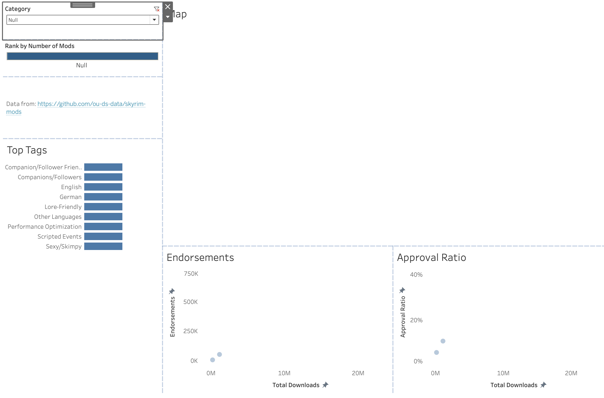

Fortunately, we can fix this issue the same way we fixed _Top Tags_.

1. Change the category in the filter back to _Models and Textures_. (Filtering on _Null_ seems like a bad idea when we are about to remove the option to filter on _Null_).
2. Go from the dashboard to the _Map_ worksheet.
3. Right click on _Category(null filter)_ and choose _Add to Context_.
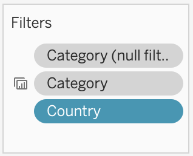
4. Go back to the dashboard and verify that _Null_ is no longer an option.

## Formatting Titles

Before we call our dashboard done, we should probably format a couple of the worksheet titles. _Endorsements_ and _Approval Ratio_ are useful and informative, but _Map_ is rather pointless, and _Top Tags_ could stand to be more informative.

1. Right click on the _Map_ title and choose _Hide Title_.
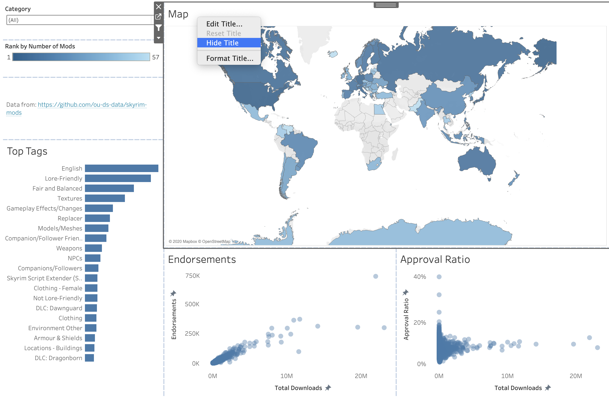
2. Right click on the _Top Tags_ title, but this time choose _Edit Title..._. Currently it is using the worksheet title as the title for the dashboard, but we can have it display any text we want.
3. Change the text to: Top Tags by Number of Mods.
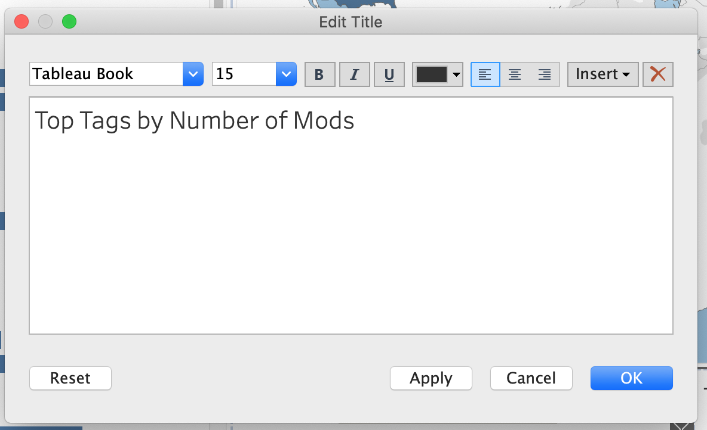
4. Click OK.

We are now ready to move on to the finishing steps of the tutorial.
