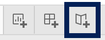
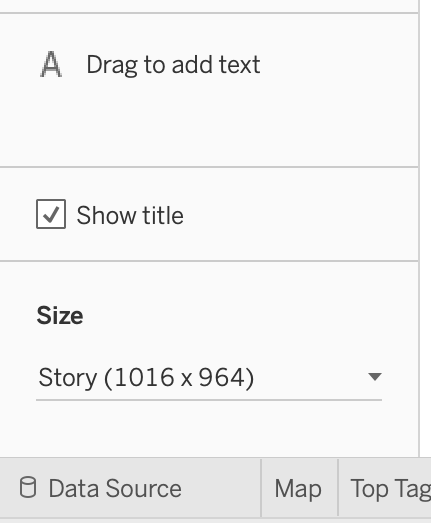
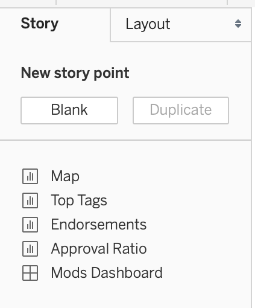
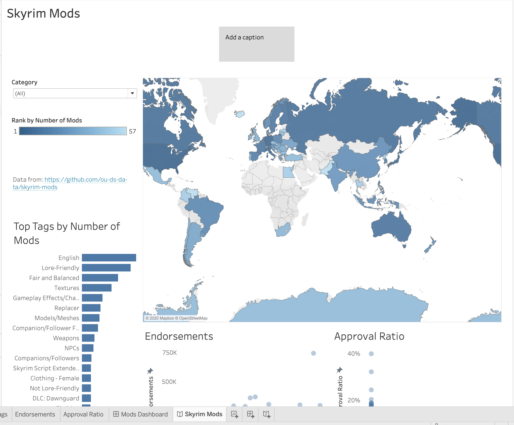
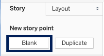
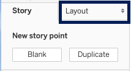
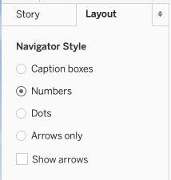
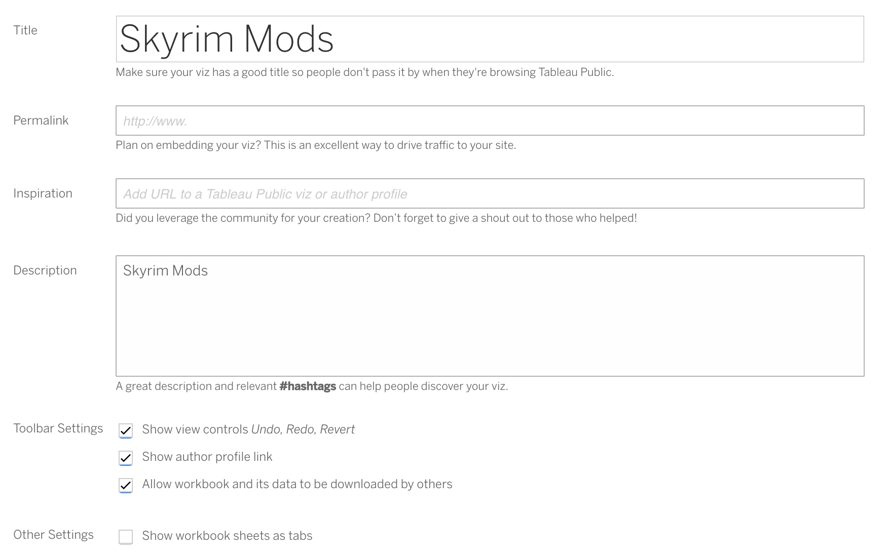

Stories are great for combining dashboards and other information. You can make a dashboard and embed it in a site where it is relevant, or you could make one or more dashboards part of a Tableau story and have the story stand on its own. Since we only have one dashboard we do not have much use for a story, but we will briefly go over how to create one. Then we will save and share our work.

!!!! ## Learning Objectives
!!!! 
!!!! - Create a story.
!!!! - Choose the navigator style for a story.
!!!! - Save a visualization to Tableau Public.

## Making a Story

! This section is optional. I recommend reading through it, but you can decide if it is worth following along in Tableau or not.

We will start by creating a new story.

1. Click the _New Story_ button at the bottom of the application to the right of _New Dashboard_.

2. Right click _Story 1_ and rename it _Skyrim Mods_.
3. Find the **Size** section on the left tab. Note that it is much lower than it is for the dashboard and that the default is for a fixed size, rather than a range. I decided to leave the size at the default, but you can change it if you prefer.

4. Find the worksheets and dashboards on the left.
! Note: All worksheets and dashboards show up in this list, but it is possible to hide some of them to avoid cluttering your view. To do this, right click on a dashboard tab that has worksheets added to it and choose the option _Hide All Sheets_. You can change this at any time by right clicking and unhiding the sheets.

5. Add the dashboard (_Mods Dashboard_) by clicking and dragging it onto the blank story.

Because we only have one dashboard there is no need to create a second story point. If we did want multiple, however, we could create a new one by choosing _Blank_ at the top of the left **Story** tab (or by duplicating our current story point).

### Navigator Layout

At the top of the story we have a small caption box. The default navigator provides a caption box for each story point. This can be useful if the story does not progress linearly, so viewers might want to switch to a different story point based on the text provided rather than simply going to the next one in order. If we do not want caption boxes, we can change our navigator style by going to the **Layout** tab.

In this example I have chosen _Numbers_ and unchecked _Show Arrows_. You can try out different ones to see which you like best.

## Saving

The visualization is complete! All that is left to do is save it to Tableau Public.

A word of caution when saving: Tableau will default to the exact state of the visualization when you save it. That is, if you are on a worksheet tab when you save, that worksheet will displayed as the visualization. If you have a filter currently selected, that filter will be selected when anyone first views your visualization. I recommend making sure no filters are currently selected and that you are on your desired tab (I recommend the dashboard for this one) before saving.

1. Save the workbook. You can do this by choosing _Save_ from the file menu, clicking the _Save_ button on the toolbar (with the floppy disk icon), or pressing **command** + **s** (Mac) or **control** + **s** (Windows).
2. Tableau will prompt you for your account info if it does not yet have it. Provide your Tableau username and password.
3. You will be asked to name the workbook. I chose _Skyrim Mods_.

## Settings

Once you have provided this information Tableau will save the visualization to its servers. It will automatically open a browser tab for you to view the published story. Once here there are a few things you may want to edit.

1. Start by clicking _Edit Details_, which should be to the right of the title, just below the visualization.

2. Here we can update the title, add a permalink to a website where we plan to embed the visualization, and provide a slightly more in depth description if we so desire.
! If you are saving the visualization, I would appreciate it if you link to this tutorial in the description.
3. We can also determine what toolbar options our viewers will have. Will they be allowed to undo, redo, or revert their actions as they interact with the visualization? Will there be an author profile link they can follow? Will they be allowed to download the workbook and its data?
4. The only other setting here is _Show workbook sheets as tabs_. Because we were on the story page when we saved the visualization, the story is currently the only thing viewers can see. However, if we show the workbook sheets as tabs, viewers will be able to look at the various worksheets and dashboards we created, as well. In general I do not bother checking this box, because I only want viewers to see the finished product.
5. After you are satisfied with your setting choices and have clicked _Save_, take a look at the bottom toolbar of the visualization. From right to left there are buttons for _Full Screen_, _Download_, _Share_, _Reset_, _Redo_, and _Undo_ (some of these may not be present if you did not allow them as options in the toolbar settings). The most important button is the _Share_ button. Clicking on this will allow you to get some code to embed the visualization in a website or to get a link to share the visualization on social media.

## Final Notes

Congratulations on creating your first visualization with Tableau!

For more ideas and inspiration, visit [Tableau's Gallery](https://public.tableau.com/en-us/gallery/?tab=viz-of-the-day&type=viz-of-the-day) of visualizations.

Check out [additional tutorials](https://libraries.ou.edu/content/digital-scholarship-lessons-and-tutorials) from our Digital Scholarship webpage.

To report issues with this tutorial or to suggest improvements, please visit the [Github issues page](https://github.com/ds-tutorials/tableau-skyrim/issues) or contact Theo Acker at `theoacker@ou.edu`.
